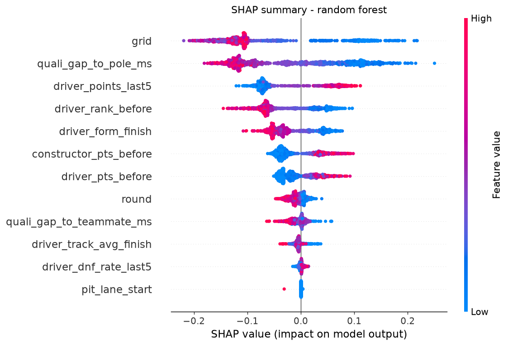

# F1 Podium Predictor

Predicting Formula 1 podium finishes from information available **before lights-out**, and
answering one honest question: **how much signal can a model add beyond where a driver
started on the grid?**

This project is built around methodological rigour rather than a headline accuracy number.
Grid position is an extremely strong predictor in modern F1, so the interesting result is
not "my model is accurate" — it is a precise, leakage-free measurement of *where* machine
learning adds value and where it does not.

**Data:** 8 seasons (2018–2025), 3,458 driver-race rows, from the
[Jolpica-F1 API](https://github.com/jolpica/jolpica-f1) (the maintained successor to Ergast)
via [FastF1](https://docs.fastf1.dev/).

---

## Headline results

Evaluated on **2024–2025**, trained only on earlier seasons (expanding-window temporal CV).
Every method predicts exactly three drivers per race, matching the three real podium slots,
which makes the comparison to the baseline exactly like-for-like.

| Model | Precision | Recall | F1 | PR-AUC |
|---|---|---|---|---|
| **Grid-only baseline** | 0.701 | 0.701 | **0.701** | 0.687 |
| Logistic regression | 0.681 | 0.681 | 0.681 | 0.668 |
| Random forest | 0.688 | 0.688 | 0.688 | **0.706** |
| XGBoost | 0.653 | 0.653 | 0.653 | 0.645 |

**No model beats the grid-only baseline on F1.** That is the honest headline, and it is a
finding about the sport: across 2018–2025, 69% of all podiums came from a top-3 grid slot.
Where you start is very nearly where you finish.

The random forest does beat the baseline on **PR-AUC (0.706 vs 0.687)** — it ranks the whole
field better, even though that improved ranking is not enough to change *which* three cars
reach the podium more often.

*(Precision, recall and F1 are identical within each row by construction: predicting exactly
3 of 3 podium slots forces them to be equal.)*

## The finding that matters: come-from-behind podiums

The aggregate table hides the most interesting result. A **"surprise podium"** is a top-3
finish from *outside* the top-3 on the grid. The grid-only baseline catches **zero of them —
by construction**, since it can only ever name top-3 starters.

Across the 2024–2025 test races there were **42** such podiums:

| Model | Recovered | Rate |
|---|---|---|
| Grid-only baseline | 0 | 0.0% (structurally impossible) |
| **Logistic regression** | **14** | **33.3%** |
| Random forest | 3 | 7.1% |
| XGBoost | 3 | 7.1% |

**This is where the engineered features earn their keep.** The logistic regression recovers a
third of the podiums a grid-based rule is mathematically blind to.

It also reveals a clear **brave-vs-cautious trade-off**: the logistic regression is willing to
promote a low-grid driver, which wins surprise podiums but costs "obvious" ones when the bet
fails — hence its lower F1. The tree models mostly trust grid: safer aggregate scores, but
they leave most surprises on the table.

> **In one sentence:** grid position dominates the easy cases so aggregate F1 barely moves,
> but the models recover come-from-behind podiums that a grid-based rule cannot express at
> all — and the simplest model recovers the most.

## What drives the predictions (SHAP)



All three models, explained independently with SHAP, rank **`grid` as the single most
important feature** — a robust, consistent result. Behind it:

1. **`grid`** — where the driver starts
2. **`quali_gap_to_pole_ms`** — a finer-grained version of the same signal (how far off pole)
3. **`driver_rank_before`** / **`driver_form_finish`** — championship standing and recent form

Every logistic-regression coefficient carries the physically correct sign: a higher grid
number, a bigger gap to pole, a worse recent average finish, and a worse championship rank all
*lower* podium odds. The model learned real racing logic, not noise.

The logistic regression weights form and championship standing relatively more against grid
than the tree models do — which is precisely why it was the model that recovered the
come-from-behind podiums.

**One honest oddity:** `driver_dnf_rate_last5` has a small *positive* coefficient, implying
recent retirements slightly raise podium odds. This is almost certainly confounding — fast
drivers in front-running cars both retire more (running hard, highly stressed machinery) and
podium more. It is a small effect and a good reminder that correlation is not causation.

## Methodology: why these results are trustworthy

**Temporal validation, never a random split.** Models train on past seasons and are tested on
future ones (train ≤2023 → test 2024; train ≤2024 → test 2025). A random train/test split
would let a model learn from late-2024 races to predict early-2024 ones — leaking the future
and inflating every score.

**An automated leakage test.** Every feature must be computable strictly *before* the race it
describes. `tests/test_no_leakage.py` proves it empirically: it builds features, then
**corrupts the outcome of one specific race** and rebuilds. If any pre-race feature changes,
future information leaked into the past.

```bash
python -m tests.test_no_leakage
# PASS - no pre-race feature changed when the race outcome was corrupted.
```

Mechanically, this is enforced by `.shift(1)` on all rolling windows, `cumsum - current` for
season points, and per-round aggregation so a teammate's result in the *same* race cannot leak
in. Imputation is fitted inside each temporal fold, never across the whole dataset.

**Accuracy is deliberately never reported.** With a ~15% base rate, always predicting "no
podium" scores ~85% accuracy while being useless. This project uses precision, recall, F1 and
PR-AUC only.

**Class imbalance handled explicitly** — balanced class weights for logistic regression and
random forest, `scale_pos_weight` for XGBoost.

## Features (12, all strictly pre-race)

| Group | Features |
|---|---|
| Grid | `grid`, `pit_lane_start` |
| Qualifying pace | `quali_gap_to_pole_ms`, `quali_gap_to_teammate_ms` |
| Driver form (last 5) | `driver_form_finish`, `driver_points_last5`, `driver_dnf_rate_last5` |
| Track history | `driver_track_avg_finish` |
| Championship (pre-round) | `driver_pts_before`, `constructor_pts_before`, `driver_rank_before` |
| Context | `round` |

## Engineering notes

The Jolpica API presented two real-world obstacles worth documenting:

- **Pagination.** Responses cap at 100 rows regardless of the requested limit, silently
  truncating a season to ~5 races. Fixed by walking every page until the season is complete.
- **Rate limiting.** Paginated bursts trigger HTTP 429 on the volunteer-run server. Fixed with
  exponential backoff and retry, plus polite delays between requests.

Data-quality reality: a **23.5% DNF rate**, 4 of 3,458 rows without a qualifying entry
(penalties/withdrawals), and ~31% of rows without prior history at that circuit (rookies,
new venues, drivers visiting a track for the first time). These gaps are genuine "we don't
know yet" values, not errors, and are handled as such.

## Limitations

F1 outcomes contain irreducible noise. Roughly a quarter of entries end in retirement, and no
pre-race model can foresee a random mechanical failure, a first-lap collision, or a
safety-car-triggered strategy inversion. The plateau in aggregate scores is a property of the
sport, not a bug in the pipeline — and a suspiciously high score here would be strong evidence
of a leak rather than a good model.

Sample sizes in the surprise-podium analysis are small (14 of 42), so that result is
directional rather than precisely estimated.

## Setup

```bash
python -m venv .venv
source .venv/bin/activate      # Windows: .venv\Scripts\Activate.ps1
pip install -r requirements.txt
```

## Run

```bash
python scripts/build_dataset.py    # Phase 1 — fetch & cache the driver-race table
python scripts/run_baseline.py     # Phase 2 — podium label + grid-only baseline
python scripts/build_features.py   # Phase 3 — leakage-safe feature engineering
python -m tests.test_no_leakage    # Phase 3 — prove no leakage
python scripts/run_models.py       # Phase 4 — temporal-CV models + surprise analysis
python scripts/run_interpret.py    # Phase 5 — SHAP interpretation
```

## Layout

```
config.py                    # all scope decisions in one place
src/data_loader.py           # Phase 1: paginated, rate-limit-resilient API loader
src/baseline.py              # Phase 2: podium label + grid-only baseline
src/features.py              # Phase 3: 12 leakage-safe features
src/model.py                 # Phase 4: temporal CV, 3 models, surprise analysis
src/interpret.py             # Phase 5: SHAP across all models
tests/test_no_leakage.py     # empirical proof that no feature sees the future
scripts/                     # one entry point per phase
reports/                     # SHAP summary plots
```

## Tech

Python · pandas · scikit-learn · XGBoost · SHAP · FastF1 · Jolpica-F1 API · Parquet

---

**Deepika Murthy** — MSc Machine Learning & Data Analytics @ Hochschule Aalen
[github.com/deeepiizz](https://github.com/deeepiizz) · [LinkedIn](https://linkedin.com/in/deepika-murthy-71686921b)